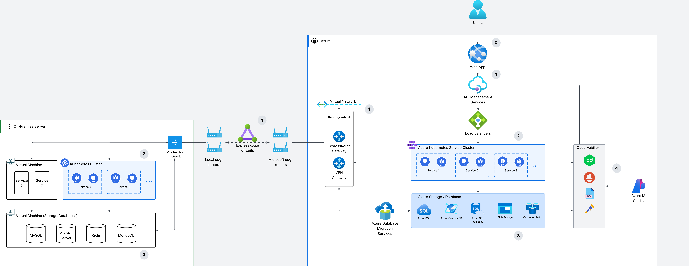
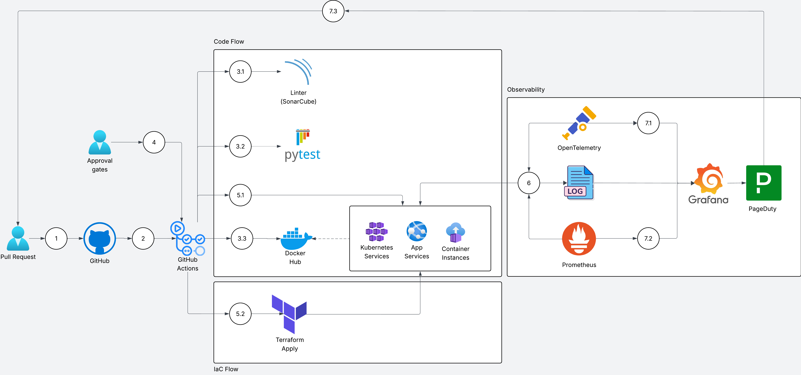
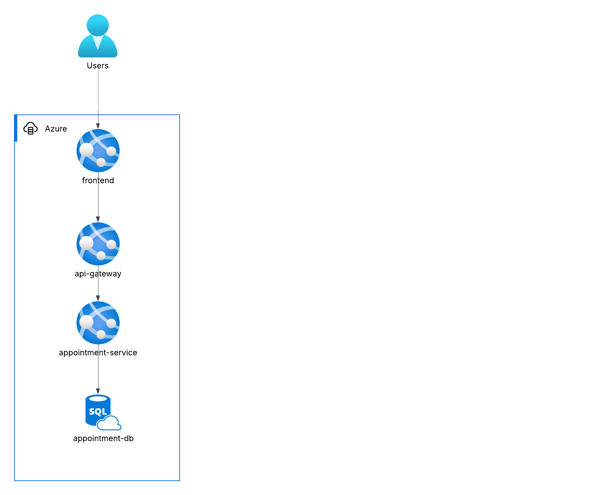

# Business case: Salus Healthcare
---
**Universidad Nacional de Colombia**<br/>
DevOps & SRE Fundamentals, 2025i

**Students:**

- Carlos Santiago Sandoval Casallas - csandovalc@unal.edu.co
- Carlos Alberto Arevalo Martinez - carlos29arevalo@gmail.com
- Ivan Andres Lemus Moreno - ialemusm@unal.edu.co
- Santiago Suárez Suárez - ssuarezs@unal.edu.co

[**Repository URL**](https://github.com/devops-2025i/salus-healthcare)

---

A monorepo for Salus healthcare SaaS MVP.

## Context

Salus Healthcare is a leading provider of electronic health record software to
the medical industry. They provide their software as a service to
multi-national medical offices, hospitals, and insurance providers.

Due to rapid changes in the healthcare and insurance industry, Salus needs
to be able to scale their environment, adapt their disaster recovery plan, and
roll out new continuous deployment capabilities to update their software at a
fast pace.

Salus’s software is currently hosted in multiple colocation facilities. The
lease on one of the data centers is about to expire. Customer-facing
applications are web-based, and many have recently been containerized to
run on a group of Kubernetes clusters. Data is stored in a mixture of
relational and NoSQL databases (MySQL, MS SQL Server, Redis, and
MongoDB).

### Technical Problem

Provide a consistent solution that allows to migrate the software from on
premise to cloud managing customer-facing applications that are
container-based. The connection between on-premises systems and cloud
must be secure and high-performance. Consider that they need to maintain
legacy interfaces to insurance providers with connectivity to both
on-premises systems and cloud providers. Provide consistent logging, log
retention, monitoring, and alerting capabilities. Maintain and manage
multiple container-based environments. Dynamically scale and provision
new environments. Create interfaces to ingest and process data from new
providers. Provide innovation using a solution based on AI.

### Delivery objective

Deliver a Minimum Viable Product (MVP) that demonstrates a cloud migration strategy for Salus Healthcare, focusing on core DevOps practices. The MVP must:

- First MVP
    - Establish a CI/CD pipeline for automated builds, tests, and deployments.
    - Align with best practices and technologies discussed in the course.
    - Introduce Infrastructure.
- Second MVP
    - Implement Infrastructure as Code (IaC) for reproducible environments.
    - Provide initial observability (logging and monitoring) capabilities.

## Business Case Exploration


## Solution Architecture

### Hybrid Cloud Architecture

This diagram illustrates the proposed hybrid cloud architecture, integrating on-premises systems with cloud-based infrastructure. It highlights secure connectivity, container orchestration (Kubernetes), and support for both legacy and modernized services.



### DevOps CI/CD and Observability Workflow

The workflow diagram details the continuous integration and deployment process, including code commits, automated testing, container builds, and deployment to cloud environments. It also shows the integration of monitoring and logging tools for observability.



### MVP Architecture

The MVP architecture focuses on a simplified version of the full system, featuring a React frontend, FastAPI-based API gateway, and an appointment microservice. Each component is containerized and managed via CI/CD pipelines, with initial infrastructure defined using Terraform.



## First MVP Scope
- **Simple, modular architecture:** A minimal set of services (frontend, API gateway, appointment microservice) to demonstrate the core workflow.
- **CI/CD implementation:** Automated pipelines for building, testing, and deploying each service using GitHub Actions.
- **Initial Infrastructure as Code (IaC):** Terraform stubs to lay the groundwork for future infrastructure automation.
- **Containerization:** All backend services are containerized for portability and scalability.


## Structure

- `frontend/`: React + Vite + TypeScript + TailwindCSS UI
- `api-gateway/`: FastAPI gateway with JWT auth, managed by `uv`
- `appointment-service/`: FastAPI microservice for appointments, SQLite, managed by `uv`
- `.github/`: CI/CD workflows
- `.iac/`: Infrastructure as Code (Terraform + Azure)

## Setup

### Frontend

```bash
cd frontend
npm install
npm run dev
```

### API Gateway

```bash
cd api-gateway
uv venv
uv pip install -r requirements.txt
uvicorn main:app --reload
```

### Appointment Service

```bash
cd appointment-service
uv venv
uv pip install -r requirements.txt
uvicorn main:app --reload --port 8001
```

### Docker

Each Python service has a Dockerfile for containerized runs.


### Docker Compose

To simplify local development and orchestration, you can use `docker-compose` to start all services together. This ensures all dependencies are started with a single command.

```bash
docker-compose up -d --build
```

This command will build and start the frontend, API gateway, and appointment service containers as defined in the `docker-compose.yml` file.

## Infrastructure as Code (IaC)

The infrastructure for Salus Healthcare is fully managed using Terraform, integrated with Azure and Terraform Cloud. All core resources—including the frontend portal, API gateway, appointment microservice, and its dedicated MySQL database—are provisioned and managed as code. The Terraform setup is connected to a Terraform Cloud organization and this GitHub repository, enabling remote state management, automated runs, and team collaboration. Infrastructure changes are versioned, reviewed, and applied through pull requests and CI/CD workflows, ensuring traceability and safe, repeatable deployments.

Key features:
- Azure App Services for all main components
- Azure Flexible MySQL for persistent data
- Terraform Cloud for state, policy, and automation
- GitHub integration for version control and automation

[See](/.iac/) `.iac/README.md` for more details on the infrastructure modules and workflow.


## Observability and Monitoring

Salus Healthcare implements comprehensive observability using Prometheus for metrics collection and Grafana Cloud for visualization and alerting. This monitoring setup ensures system reliability, performance tracking, and proactive issue detection across all services.

### Prometheus Integration

Each microservice is instrumented with Prometheus metrics:

- **Custom Metrics**: Request counters, latency histograms, and business-specific KPIs
- **FastAPI Instrumentator**: Automatic HTTP metrics for all API endpoints
- **Health Checks**: Service availability and dependency monitoring
- **Container Metrics**: Resource utilization and performance data

### Grafana Cloud Remote Write

The system uses Prometheus remote write functionality to send metrics directly to Grafana Cloud:

- **Real-time Streaming**: Metrics are continuously pushed to Grafana Cloud for centralized monitoring
- **Long-term Storage**: Historical data retention beyond local Prometheus storage (1h local, unlimited in cloud)
- **Multi-environment Support**: Development, staging, and production metrics in unified dashboards
- **Secure Transport**: Encrypted transmission using API tokens and HTTPS

### Configuration

Metrics collection is configured through:
- `prometheus.yml`: Remote write configuration with Grafana Cloud endpoints
- Environment variables: API tokens and authentication credentials
- Service instrumentation: Custom metrics definitions in each microservice

### Accessing Metrics

- **Local Development**: 
  - Prometheus UI: `http://localhost:9090`
  - Service metrics: `http://localhost:8001/metrics` (appointment service)
  - API Gateway: `http://localhost:8000/metrics`

- **Azure Production Environment**:
  - Frontend: https://salus-frontend-2.azurewebsites.net
  - API Gateway: https://salus-api-gateway-2.azurewebsites.net/metrics
  - Appointment Service: https://salus-appointment-service-2.azurewebsites.net/metrics
  - *Note: Azure App Service URLs may vary with each deployment cycle*

- **Centralized Monitoring**: Grafana Cloud portal for unified dashboards and alerting

### Future Enhancements

*Grafana dashboard screenshots and performance analytics will be added here as the monitoring infrastructure matures.*

## CI/CD Pipelines

This repository uses several GitHub Actions workflows to ensure quality, integration, deployment, and continuous delivery for the main services: Appointment Service, API Gateway, Frontend, and Azure infrastructure.

[See](/.github/workflows/) `.github/workflows/README.md` for more details.


## Testing Reports

- Api Gateway: [api-gateway/report.html](https://devops-2025i.github.io/salus-healthcare/api-gateway/report.html)
- Appointment Service: [appointment-service/report.html](https://devops-2025i.github.io/salus-healthcare/appointment-service/report.html)
- Frontend: [frontend](https://devops-2025i.github.io/salus-healthcare/frontend)

## Docker Hub Registry

All container images built for this project are available at:
[https://hub.docker.com/u/ialemusm](https://hub.docker.com/u/ialemusm)
